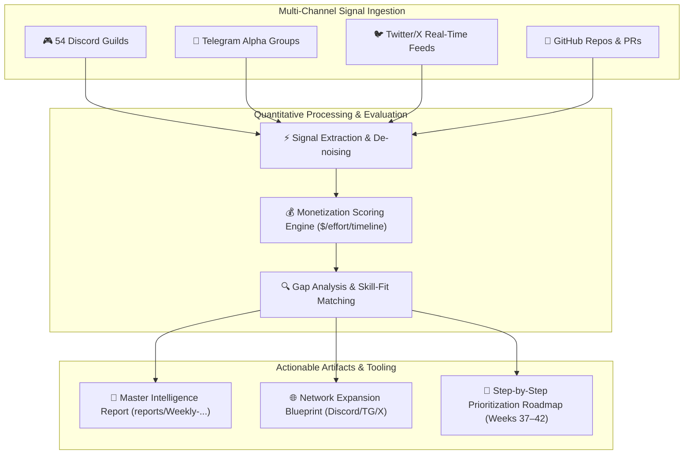

# 🌐 Web3 Ecosystem Intelligence & Monetization Masterplan

[](https://opensource.org/licenses/MIT)
[](reports/Weekly-Monetization-Intelligence-2026-W36.md)
[](reports/Weekly-Monetization-Intelligence-2026-W36.md)
[](reports/Weekly-Monetization-Intelligence-2026-W36.md)

Autonomous multi-agent intelligence investigation across **54 Discord servers**, **Telegram developer & research groups**, **Twitter/X feeds**, **GitHub repositories**, and onchain governance to identify and capture high-yield revenue, grant, and commercial modeling opportunities for cryptoeconomic engineering teams.

---

## 📊 High-Level Monetization Matrix

```
┌─────────────────────────────────────────────────────────────────────────────────────────────┐
│                                2026-W36 MONETIZATION PIPELINE                               │
├─────────────────────────────────────────┬──────────────────────┬────────────────────────────┤
│ Track 1: Foundation Grants & RFPs       │ $235,000 – $845,000+ │ 8 Profiled Programs        │
│ Track 2: Protocol Modeling & Consulting │ $220,000 – $430,000  │ 7 Enterprise Client Leads  │
│ Track 3: Validator Economics & Staking  │ $4,100 – $10,500+/mo │ 7 Node & DVT Yield Schemes │
│ Track 4: Hackathons & Bounty Pools      │ $35,000 – $88,000    │ 7 High-ROI Prize Pools     │
├─────────────────────────────────────────┼──────────────────────┼────────────────────────────┤
│ TOTAL ADDRESSABLE PIPELINE              │ $572,000 – $1,600,000│ 29 Profiled Units          │
└─────────────────────────────────────────┴──────────────────────┴────────────────────────────┘
```

---

## 🗺️ System Architecture & Intelligence Workflow



---

## 🎯 Top Immediate Action Vectors (Week 37)

1. **🏆 ETHOnline 2026 Bounty Capture (Sept 4–16 · $100k+ Prize Pool)**:
   - Deploy `HookCAD / AeroCurve` (dynamic bonding curve & liquidity hooks for Uniswap v4).
   - Target multi-track bounties across **Uniswap Foundation ($5k)** + **Hedera ($15k)** + **0G Network ($15k)** + **The Graph ($15k)**.
2. **🏛️ Avalanche Retro9000 & Stacks Endowment Grants ($55k–$100k)**:
   - Repackage BCRG PSUU simulation lineage for **Avalanche9000 ACP-77 fee burn calibration**.
   - Submit the **sBTC peg stability & 70% signer game theory proposal** via warm Nethermind research channels.
3. **⚡ Turnkey Validator Staking Cashflows ($4.1k–$10.5k/mo)**:
   - Deploy a 4-node **Lido CSM + Obol DVT cluster** requiring only **0.125–0.375 ETH bond** for **6.0%–7.8% APR** (3.1x capital efficiency).
   - Micro-lease AVAX validation nodes via **BENQI Ignite PAYG** to establish low-capital yield engines.

---

## 📂 Repository Contents

- 📁 [`reports/Weekly-Monetization-Intelligence-2026-W36.md`](reports/Weekly-Monetization-Intelligence-2026-W36.md) — The complete 1,020-line Master Intelligence Report with mathematical specifications, contact routes, grant rubrics, and step-by-step submission checklists.

---

## 🌐 Network Expansion Blueprint

### Recommended Discord Servers
- **Uniswap Foundation / Hook Incubator** — `discord.gg/uniswap` *(v4 hook development & grants)*
- **Flashbots / Collective** — `discord.gg/flashbots` *(MEV economics, SUAVE, MEV-Boost research)*
- **EigenLayer Research** — `discord.gg/eigenlayer` *(AVS economic security & slashing modeling)*
- **Berachain / Boyco Builders** — `discord.gg/berachain` *(Proof-of-Liquidity validator dynamics)*
- **Morpho Labs Core** — `discord.gg/morpho` *(Vault risk modeling, LLTV curation bounties)*
- **Obol Network / DVT Core** — `discord.gg/obol` *(Distributed Validator clusters & testing)*

### Recommended Telegram Groups
- `@tokenengineering` — Token Engineering Commons / cadCAD Global
- `@mechanisms_research` — Cryptoeconomic mechanism design & AMM math
- `@ethresearch_digest` — Ethereum R&D, EIPs, and consensus layer alpha
- `@restaking_alpha` — EigenLayer, Symbiotic, and Karak AVS economics

---

## 📜 License
MIT License. Free to use, adapt, and build upon.
