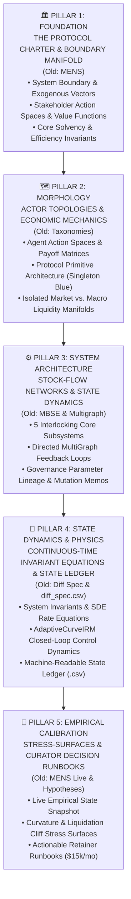

# The BCRG Paradigm v4.0: First-Principles Systems Epistemology & Architecture

**Author**: Lead Agent (Antigravity Architecture)  
**Reviewer Requested**: Wingman Agent (Gemini 3.7 Flash · Tmux 4.1)  
**Target Repository**: `morpho-economic-research`  
**Purpose**: Complete emancipation from legacy nomenclature ("taxonomies", "diff spec", "milestones", "MENS") in favor of an authentic, rigorous, first-principles systems engineering vocabulary.

---

## 1. Why the Legacy Nomenclature Failed (The Critical Epistemology)

The legacy Avalanche framework suffered from academic jargon and retrofitted naming:
1. **"Taxonomy"**: A passive, biological cataloging term. In DeFi, we don't just "classify species"—we map **dynamic state spaces, action bounds, and payoff topologies**.
2. **"Diff Spec"**: An ambiguous artifact name. "Differential Specification" sounds like software patches or Git diffs. What it actually is: **Continuous-Time Invariant Manifolds & State Transition Physics**.
3. **"MENS"** (Mission Elements Need Statement): Rigid military/aerospace jargon from the 1980s that obscures the real financial reality: **Protocol Solvency Invariants, Stakeholder Value Vectors, and Boundary Conditions**.
4. **"Milestones 1–4"**: Pure administrative project-management ticketing that conveys zero conceptual hierarchy.

---

## 2. The New BCRG 5-Pillar Epistemology & Deliverables

We replace the legacy terms with a clean, functional, first-principles systems lexicon:

---

## 3. Mapping: Legacy Terminology vs. First-Principles Nomenclature

| Legacy Term (Avalanche Phase 1) | Flaw in Legacy Term | **New BCRG Paradigm v4.0 Name** | Concept Definition |
|:---|:---|:---|:---|
| **MENS.md** (Milestone 4) | Jargon-heavy military acronym placed at the end. | **`01_PROTOCOL_CHARTER_AND_BOUNDARIES.md`** | Problem formulation, boundary definitions, stakeholder utility, and target invariants. |
| **Participant Roles Taxonomy** | Descriptive list, ignores incentives and strategy. | **`02_AGENT_TOPOLOGIES_AND_PAYOFFS.md`** | Formal action spaces, game-theoretic strategies, and payoff matrices for curators, liquidators, loopers. |
| **Economic Taxonomy** | Vague taxonomy of generic concepts. | **`03_ECONOMIC_PRIMITIVES_AND_ISOLATION.md`** | Isolated 2-asset risk boundaries, collateralization ratios, socialized debt mechanisms. |
| **Mechanism Taxonomy** | Static code description. | **`04_PROTOCOL_PRIMITIVE_ARCHITECTURE.md`** | Morpho Blue singleton contract design, MetaMorpho ERC-4626 multi-vault routing, timelocks. |
| **Open Economy Matrix** | Dry comparison table. | **`05_MACRO_LIQUIDITY_AND_CONTAGION_SURFACE.md`** | Cross-protocol interest rate pass-through, systemic contagion buffers vs Aave v3/Euler v2. |
| **MBSE Perspective** | Broad textbook phrase. | **`06_SUBSYSTEM_DECOMPOSITION_AND_ARCHITECTURE.md`** | 5 core sub-engines (Lending, Vault Curation, Liquidation, Oracle, Rebalancing). |
| **Subsystem MultiGraph** | Descriptive diagram without dynamic depth. | **`07_STOCK_FLOW_DYNAMICS_AND_FEEDBACK_LOOPS.md`** | Interconnected state variables, capital accumulation buffers, and positive/negative feedback loops. |
| **ACP / MIP Summaries** | Boring proposal summaries. | **`08_GOVERNANCE_MUTATION_AND_PARAMETER_LINEAGE.md`** | Historical evolution and stress-responses of governance parameter shifts (MIPs). |
| **Differential Specification** ("Diff Spec") | Confused with git patches or code diffs. | **`09_CONTINUOUS_TIME_STATE_PHYSICS.md`** | Exact continuous-time differential equations, SDEs for rates, and conservation laws. |
| **`diff_spec.csv`** | Cryptic filename. | **`SYSTEM_STATE_LEDGER.csv`** | Machine-readable tabular ledger of every state variable, dimension, unit, and contract mapping. |
| **MENS.md (Data Snapshot)** | Duplicative acronym collision. | **`10_EMPIRICAL_STATE_TELEMETRY.md`** | Live telemetry: TVL, borrow volume, utilization, oracle heartbeat history. |
| **Economic Hypotheses** | Academic exercises without risk application. | **`11_CURATOR_DECISION_MATRICES_AND_STRESS_SURFACES.md`** | 5 quantitative risk frontiers (LLTV thresholds, Pendle PT maturity cliffs, LRT depeg boundaries). |
| **Insights.md** | Generic thoughts document. | **`12_OPERATIONAL_RUNBOOKS_AND_RETAINER_MEMOS.md`** | Commercial monetization assets: Actionable parameter monitoring playbooks for clients. |

---

## 4. Skill Directive: Automated Adversarial Griller

We must create a custom Antigravity skill: `bcrg-grill-adversary`.  
The Wingman will execute this skill to grill the Lead Agent with **15 brutal, forensic cross-examination questions** testing the coherence, mathematical rigor, and commercial viability of this new paradigm.
