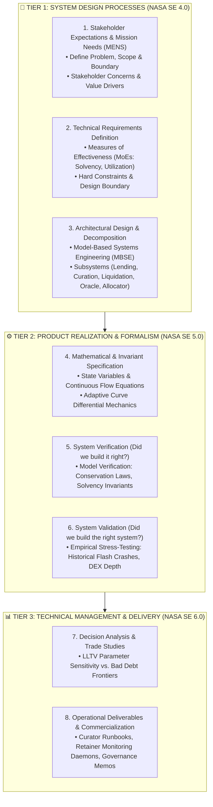
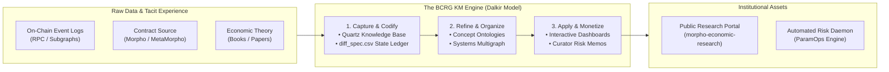

# The BCRG Operating Framework v3.0: Systems Engineering Engine & Knowledge Management Architecture

**Foundational Authorities**:  
1. *NASA Systems Engineering Handbook* (NASA SP-2016-6105 Rev 2 / NPR 7123.1)  
2. *Systems Engineering and Analysis* (Blanchard & Fabrycky, 5th Ed.)  
3. *Knowledge Management in Theory and Practice* (Kimiz Dalkir, 4th Ed.)  
4. *Theory of Modeling and Simulation* (Bernard P. Zeigler)  

---

## 1. The Core Realization: Why We Must Rethink the Process

Until now, BCRG research had two major operational bottlenecks:
1. **The "Retroactive Documentation" Trap**: Milestones were treated as writing exercises where artifacts were created haphazardly without strict input-output gates.
2. **Knowledge Dissipation & Tool Sprawl**: Valuable quantitative discoveries, formulas, and data scrapes were trapped in unstructured markdown files or ephemeral chat logs instead of a shared, cumulative Knowledge Repository.

By integrating the **NASA Systems Engineering (SE) Engine** with **Dalkir's Knowledge Management (KM) Cycle**, we transform BCRG from a loose research group into an **institutional-grade quantitative engineering firm**.

---

## 2. The 3-Tier Systems Engineering Architecture

The NASA SE Engine defines 3 recurring loops: **System Design**, **Product Realization**, and **Technical Management**.

---

## 3. Knowledge Management (KM) Architecture (Dalkir Cycle)

According to Kimiz Dalkir, effective KM consists of three continuous phases:
1. **Knowledge Creation & Capture**: Converting raw DeFi transactions, smart contract code, and math into structured, explicit knowledge.
2. **Knowledge Sharing & Dissemination**: Making research immediately navigable for agents, human engineers, and DAO stakeholders.
3. **Knowledge Acquisition & Application**: Applying models directly to produce client deliverables ($15k/mo retainers).

---

## 4. Tooling & Project Management: GitHub Projects vs. Other Tools

### The Verdict on Tooling:
We should use **GitHub Projects (v2 Tables + Board View)** as our single source of truth, supported by **Quartz v4** for knowledge publishing and **GitHub Releases** for versioned mathematical specifications.

### Why GitHub Projects Beats External Tools (Notion, Jira, Asana, Linear):
1. **Zero-Context-Switching Multi-Agent Integration**: Both Lead and Wingman agents can interact directly with GitHub via `gh` CLI and the GitHub MCP server. We can create issues, close milestones, and update swimlanes programmatically without human friction.
2. **Direct Traceability (NASA NPR 7123.1 Compliance)**: Every requirement in `MENS.md` links to a specific GitHub Issue, which links to a PR, which links to a verified Python simulation or mathematical proof.
3. **Open Verification for Curators**: When pitching Steakhouse or Block Analitica, our entire engineering rigor is publicly verifiable on GitHub.

### Recommended GitHub Project Board Configuration:
* **View 1: NASA SE Workflow (Kanban)**:
  `Backlog` $\rightarrow$ `System Design (MENS/Taxonomies)` $\rightarrow$ `Formalism & Math` $\rightarrow$ `Verification & Simulation` $\rightarrow$ `Peer Review / Done`.
* **View 2: Stakeholder Swimlanes (Group by Client Need)**:
  - *Track A: Solvency & Bad Debt Risk* (Curator Stakeholder)
  - *Track B: Adaptive IRM & Capital Efficiency* (Lender/Borrower Stakeholder)
  - *Track C: Liquidation Slippage & Oracles* (Liquidator Stakeholder)

---

## 5. Standard Deliverable Specification

For every protocol we research, the exact set of **8 Core Deliverables** must be produced:

| # | Phase | Deliverable | NASA SE Mapping | Purpose |
|:---:|:---|:---|:---|:---|
| **D1** | Stage 0 | **`MENS.md`** | Stakeholder Expectations Definition | Problem, Boundaries, Stakeholder Needs, MoEs |
| **D2** | Stage 1 | **Taxonomies Suite** (`Roles`, `Econ`, `Mech`, `Macro`) | Technical Requirements Definition | 4 foundational taxonomy documents |
| **D3** | Stage 2 | **MBSE Subsystems & Multigraph** | Logical Decomposition | Stock-flow dynamics, feedback loops, and state maps |
| **D4** | Stage 2 | **MIP Governance Evolution** | Architectural Trade Studies | Historical governance parameter changes |
| **D5** | Stage 3 | **Differential Specification** | Design Solution Definition | Continuous-time calculus, IRM SDEs, invariants |
| **D6** | Stage 3 | **`diff_spec.csv`** | Traceability Matrix | Machine-readable ledger of state variables and units |
| **D7** | Stage 4 | **Empirical Data Snapshot (MENS-Live)** | Product Verification | Live on-chain TVL, borrow volume, and utilization |
| **D8** | Stage 4 | **Curator Hypotheses & Runbooks** | Product Validation & Operations | Actionable parameter advisory memos for retainers |
