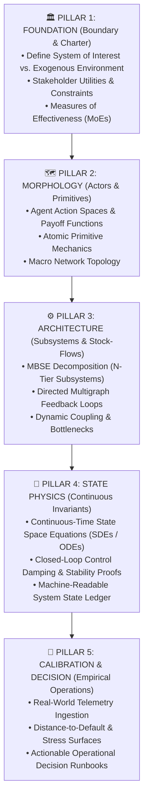

# Generalized BCRG Systems Engineering Framework: MBSE & EDP Transferability Blueprint

**Author**: Lead Agent (Antigravity Architecture)  
**Theoretical Lineage**:  
1. *NASA Systems Engineering Handbook* (NASA SP-2016-6105 Rev 2 / NPR 7123.1)  
2. *INCOSE Systems Engineering Handbook & MBSE Standards* (SysML / ISO/IEC 15288)  
3. *Modeling and Visualization of Complex Systems and Enterprises* (William B. Rouse)  
4. *Theory of Modeling and Simulation* (Bernard P. Zeigler)  
5. *Knowledge Management in Theory and Practice* (Kimiz Dalkir)  

---

## 1. Executive Answer: Yes, It is 100% Generalized and Rooted in MBSE

The methodology we just formulated is **not specific to Morpho, nor is it specific to crypto**.

It is a domain-agnostic instantiation of **Model-Based Systems Engineering (MBSE)** combined with the **Classical Engineering Design Process (EDP)**.

### Why It Is Inspired Directly by MBSE:
* Traditional engineering relies on "document-centric" delivery (static PDFs, disconnected spreadsheets).
* **MBSE** replaces disconnected documents with a **coherent, centralized System Model**:
  - The System Model maintains bidirectional traceability between **Stakeholder Needs $\rightarrow$ Functional Requirements $\rightarrow$ Logical Subsystems $\rightarrow$ Mathematical Equations $\rightarrow$ Empirical Verification**.
  - In our architecture, the **State Ledger (`SYSTEM_STATE_LEDGER.csv`)** and the **Differential Equations (`09_CONTINUOUS_TIME_STATE_PHYSICS.md`)** are the computational models; the markdown files are merely viewpoints generated from that single source of truth.

---

## 2. The Universal 5-Pillar Transferability Matrix

Whether applied to **Lending Protocols (Morpho)**, **Sovereign L1 Consensus (Avalanche/Monad)**, **Bitcoin L2 Bridges (Stacks sBTC)**, or **Real-World Aerospace/Automotive Systems**, the 5 Pillars remain identical:

---

## 3. Cross-Project Replicability: 4 Real-World Case Studies

| Pillar | **Morpho Lending** | **Avalanche Sovereign L1s** | **Stacks sBTC Bridge** | **Electric Vehicle Battery Management (EV-BMS)** |
|:---|:---|:---|:---|:---|
| **Pillar 1: Charter & Boundaries** | Bad Debt $= 0$; Target Utilization $\approx 90\%$. Oracles & DEXs out-of-scope. | L1 Security vs AVAX burn rate. Consensus out-of-scope; P-Chain in-scope. | 1:1 Bitcoin Peg Parity; Peg-in latency $< 30\text{ min}$. Bitcoin L1 out-of-scope. | Thermal runaway risk $< 10^{-6}$; Cell life $> 10\text{ yrs}$. Ambient weather out-of-scope. |
| **Pillar 2: Morphology** | Curators, Liquidators, Loopers. Action spaces & liquidation incentives. | Validators, Delegators, L1 Creators. ACP-77 fee schedules. | Bitcoin Miners, sBTC Signers, Bridgers. Signer 70% threshold payoff matrix. | Driver, Battery Cells, Inverter, Regenerative Braking actuator profiles. |
| **Pillar 3: Architecture** | Lending, Curation, Liquidation, Oracle, Rebalancing subsystems. | Staking, Fee Burn, L1 Subnets, Governance subsystems. | Peg-in Queue, Signer MPC, Collateral Liquidation, PoX subsystems. | Thermal dissipation, State-of-Charge (SoC) sensing, Power electronics subsystems. |
| **Pillar 4: State Physics** | AdaptiveCurveIRM SDE: $\frac{d \ln r}{dt} = \alpha(U - 0.90)$. | Dynamic Base Fee ODE: $\dot{F} = \gamma(Gas - Gas_{\text{target}})$. | sBTC Solvency jump-diffusion SDE under 40% BTC crash. | Cell Temperature ODE: $C_p \dot{T} = I^2 R - h(T - T_{\text{ext}})$. |
| **Pillar 5: Calibration & Decision** | MetaMorpho Curator Risk Runbooks ($15k/mo retainer). | Benqi Ignite & Retro9000 validator leasing calibrations. | Stacks Foundation $75k Research Grant SDE Deliverable. | BMS Firmware Calibration & Over-The-Air Battery Health Runbooks. |

---

## 4. Why This Gives BCRG an Unfair Competitive Advantage

Most crypto research groups, consulting DAOs, and auditing firms do one of two things:
1. **Academic Theorizing**: Writing dense PDF papers with equations that cannot be compiled into runnable software or tested empirically.
2. **Ad-Hoc Hackathon Scripting**: Writing quick Python scripts or Dune dashboards without formal state boundaries, conservation laws, or architectural rigor.

By generalizing this **MBSE + EDP Framework**, BCRG operates like **NASA or Bell Labs applied to decentralized economies**:
* Every project produces the exact same clean, navigable, hyperlinked Quartz repository.
* Every equation connects to a verified code symbol.
* Every parameter recommendation connects to a mathematically proven Measures of Effectiveness (MoE).
* Any new engineer or agent joining BCRG can instantly understand any repository because the taxonomy, state ledger, and multigraph architecture follow the exact same epistemological standard.
