# BCRG Systems Methodology v2.0: The Engineering Design Process (EDP) Integration

**Author**: Lead Agent (Antigravity Architecture)  
**Target Repository**: `morpho-economic-research`  
**Core Thesis**: Moving from ad-hoc retroactive documentation to a rigorous, sequential **Engineering Design Process (EDP)**.

---

## 1. The Retrospective Critique: Why the Old Workflow Was Backwards

In our prior Avalanche Phase 1 research, the **Mission Elements Need Statement (MENS.md)** was buried in **Milestone 4**.

This was a classic systems engineering anti-pattern:
> *Writing the Mission Statement, Stakeholder Concerns, System Boundary, and Measures of Effectiveness at the END of the research cycle after the taxonomies and math are already written.*

As demonstrated in the **Engineering Design Process (EDP)** framework:
1. **Define the Problem** (Who needs what, why, and what are the constraints?)
2. **Identify Criteria & Constraints** (What makes a solution viable vs fatal?)
3. **Explore Solutions & System Decompositions** (Taxonomies, Subsystems, Multigraphs)
4. **Model & Prototype** (Differential equations, Invariants, Simulation specifications)
5. **Test, Evaluate & Refine** (Empirical snapshots, Stress tests, Parameter calibrations)
6. **Communicate & Deliver** (Actionable runbooks, Governance proposals, Curator retainers)

If you don't define the **Mission, Stakeholders, and Needs on Day 1**, you end up modeling parameters blindly without knowing whose problem you are solving.

---

## 2. The Upgraded BCRG 5-Stage Architecture for Morpho

We replace the old Milestone 1–4 structure with an explicit **EDP-Aligned Research Architecture**:

```mermaid
graph TD
    subgraph S0 ["🎯 STAGE 0: Problem Formulation & MENS (The Foundation)"]
        S0_1["Mission Elements Need Statement (MENS)<br>• Mission Context & Objectives<br>• System Boundary Definition (What is IN vs OUT of Morpho Blue)<br>• Stakeholder Analysis (Curators, Depositors, Liquidators, Borrowers)<br>• Stakeholder Concerns & Needs Derivation<br>• Measures of Effectiveness (MoE: Bad Debt = 0, Utilization ≈ 90%, Capital Efficiency)"]
    end

    subgraph S1 ["🏛️ STAGE 1: Domain Taxonomies & Environmental Boundaries"]
        S1_1["Participant Roles & Incentive Topologies"]
        S1_2["Economic Taxonomy (Isolated Risk, LLTV, Adaptive IRM, Socialized Debt)"]
        S1_3["Mechanism Taxonomy (Singleton Blue, MetaMorpho v1/v2, Public Allocators)"]
        S1_4["Morpho in the Macro DeFi Topology (vs Aave v3, Euler v2, Silo)"]
    end

    subgraph S2 ["⚙️ STAGE 2: Model-Based Systems Engineering (MBSE) & Subsystems"]
        S2_1["5 Subsystem Decompositions (Lending, Curation, Liquidation, Oracle, Allocator)"]
        S2_2["Subsystem MultiGraph: Stocks, Flows & Dynamic Feedback Loops"]
        S2_3["Governance Lineage & MIP Evolution"]
    end

    subgraph S3 ["🧮 STAGE 3: Mathematical Formalism & Differential Invariants"]
        S3_1["Continuous-Time State Space Equations"]
        S3_2["AdaptiveCurveIRM Differential Feedback Mechanics"]
        S3_3["Liquidation Cliff & Secondary DEX Slippage Bounds"]
        S3_4["diff_spec.csv (Traceability Matrix)"]
    end

    subgraph S4 ["🔬 STAGE 4: Empirical Testing, Calibration & Operational Runbooks"]
        S4_1["Morpho Empirical Network Snapshot (MENS-Live Data)"]
        S4_2["Testable Curator Hypotheses (LRT LLTV, Pendle PT Decay, Allocator Drag)"]
        S4_3["Curator Operational Runbooks & Retainer Memos"]
    end

    S0 --> S1 --> S2 --> S3 --> S4
```

---

## 3. Immediate Implementation Directive

1. **Stage 0 (`content/stage0/MENS.md`) Must Be Authored First**:
   - Define Morpho's core mission: *Zero-bad-debt, capital-efficient, permissionless lending markets*.
   - Define the primary customer: **MetaMorpho Curators** (Steakhouse, Block Analitica, B.Protocol).
   - Establish the Measures of Effectiveness (MoE).
2. **Re-align Repository Layout**:
   - Re-organize `morpho-economic-research` content folders to reflect the true engineering workflow:
     `stage0-mens/`, `stage1-taxonomies/`, `stage2-mbse/`, `stage3-math/`, `stage4-calibration/`.
