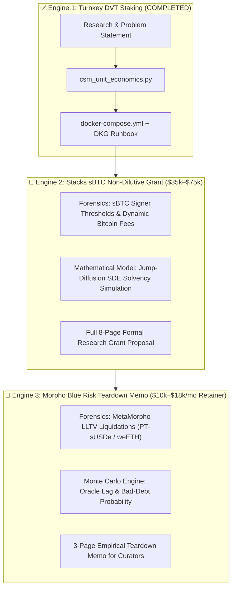

# Master Execution Plan: Multi-Agent Monetization Engines (Engines 2 & 3)

**Branch**: `feature/ground-truth-monetization-playbook`  
**Orchestration Model**: Autonomous Lead Agent (Gemini 3.8 Flash) + Wingman Agent (Gemini 3.7 Flash in Tmux 4.1)  
**Coordination Bus**: `deliverables/COORDINATION_BUS.md` + Git Tracking

---

## 🗺️ Architectural Phase Map

---

## 📋 Task Breakdown & Agent Delegation Matrix

| ID | Task Description | Primary Agent | Verification & Review | Deliverable Path | Status |
|:---|:---|:---|:---|:---|:---:|
| **E1.1** | Lido CSM + Obol DVT Research & Problem Statement | Wingman (4.1) | Lead Agent (Context7 Audit) | `deliverables/engine_1_dvt/RESEARCH_AND_PROBLEM_STATEMENT.md` | ✅ **DONE** |
| **E1.2** | Unit Economics & Sensitivity Model (`csm_unit_economics.py`) | Lead Agent | Contract Spec Verification | `deliverables/engine_1_dvt/csm_unit_economics.py` | ✅ **DONE** |
| **E1.3** | Docker Compose Stack & DKG Runbook | Wingman (4.1) | Lead Agent Code Audit | `deliverables/engine_1_dvt/infra/docker-compose.yml` | ✅ **DONE** |
| **E2.1** | **Stacks sBTC Forensics & Signer Fee Game Theory** | Wingman (4.1) | Lead Agent (Audit against SIPs) | `deliverables/engine_2_stacks/RESEARCH_AND_PROBLEM_STATEMENT.md` | ⏳ **NEXT** |
| **E2.2** | **sBTC Jump-Diffusion SDE & Solvency Simulator** | Lead Agent | SymPy / NumPy Mathematical Audit | `deliverables/engine_2_stacks/sbtc_solvency_sde.py` | ⏳ **PENDING** |
| **E2.3** | **Formal 8-Page Non-Dilutive Grant Proposal** | Both (Split) | Lead Agent Final Synthesis | `deliverables/engine_2_stacks/GRANT_PROPOSAL_STACKS_ENDOWMENT.md` | ⏳ **PENDING** |
| **E3.1** | **Morpho Blue LLTV Liquidation Risk Research** | Wingman (4.1) | Lead Agent (Context7 / Contract Check) | `deliverables/engine_3_morpho/RESEARCH_AND_PROBLEM_STATEMENT.md` | ⏳ **QUEUED** |
| **E3.2** | **Monte Carlo Oracle Lag & Bad-Debt Simulation** | Lead Agent | Statistical Audit | `deliverables/engine_3_morpho/morpho_bad_debt_mc.py` | ⏳ **QUEUED** |
| **E3.3** | **3-Page Executive Risk Memo for MetaMorpho Curators** | Lead Agent | Curator-Ready Packaging | `deliverables/engine_3_morpho/METAMORPHO_RISK_TEARDOWN.md` | ⏳ **QUEUED** |

---

## 🔄 Autonomous Loop Protocol (Zero Manual Intervention)

1. **Direct Task Dispatch**: Lead Agent writes next task specifications directly to `COORDINATION_BUS.md` and signals Wingman via tmux pane IPC.
2. **Background Watcher**: Lead Agent runs a non-blocking watcher on Git HEAD and tmux pane state.
3. **Automated Verification**: When Wingman pushes, Lead Agent automatically pulls, verifies deliverables with Context7/tests, and advances to the next step.
