# Master Execution Plan: Morpho Economic Research Marathon & Systems Map

**Target Portal**: `morpho-economic-research` (modeled after [`avalanche-research`](https://bonding-curves.github.io/avalanche-research/))  
**Architect**: Lead Agent (Antigravity Architecture)  
**Research Lead**: Wingman Agent (Gemini 3.7 Flash · Quantitative Risk Lead)  
**Target Clients**: MetaMorpho Curators (Steakhouse Financial, Block Analitica, B.Protocol, Re7 Labs, Gauntlet) & Morpho DAO  
**Commercial Value**: $10,000 – $18,000 / month Recurring Risk Advisory Retainer & $25k–$50k Vault Audits  
**Status**: **APPROVED FOR PRODUCTION EXECUTION**  

---

## 🗺️ Systems Map & 4-Milestone Framework

```mermaid
graph TD
    subgraph M1 ["🏛️ Milestone 1: Foundational Taxonomies"]
        M1_1["Participant Roles Taxonomy<br>(Curators, Borrowers, Lenders, Liquidators, Allocators)"]
        M1_2["Economic Taxonomy<br>(Isolated Risk, LLTV, Adaptive Curves, Bad Debt)"]
        M1_3["Mechanism Taxonomy<br>(Morpho Blue Singleton, MetaMorpho v1/v2, Bundlers)"]
        M1_4["Morpho vs. Open DeFi Economy<br>(Aave v3, Euler v2, Silo, Compound Comparative Matrix)"]
    end

    subgraph M2 ["⚙️ Milestone 2: Systems Engineering & Multigraph"]
        M2_1["MBSE Systems Perspective<br>(5 Core Subsystems: Lending, Curation, Liquidation, Oracle, Allocator)"]
        M2_2["Subsystem MultiGraph & State Maps<br>(Continuous Stock-Flow Dynamics & Feedback Loops)"]
        M2_3["MIP Governance Evolution<br>(Morpho Improvement Proposals 1–15 Analysis)"]
    end

    subgraph M3 ["🧮 Milestone 3: Mathematical & Differential Specification"]
        M3_1["Continuous Time State Equations<br>(TotalSupplyAssets, TotalBorrowAssets, Shares Conversion)"]
        M3_2["AdaptiveCurveIRM Differential Mechanics<br>(Target Utilization 90%, Speed of Adjustment, Rate Bounds)"]
        M3_3["100% Binary Liquidation Cliff Invariants<br>(Beta-Incentive Scaling & DEX Slippage Boundaries)"]
        M3_4["diff_spec.csv<br>(Machine-Readable State Variable & Flow Mapping)"]
    end

    subgraph M4 ["📊 Milestone 4: Empirical Calibration & Curator Hypotheses"]
        M4_1["Morpho Empirical Network Snapshot (MENS)<br>(Live TVL, Borrow Volume, Bad Debt, and Utilization Data)"]
        M4_2["5 Testable Curator Hypotheses<br>(LRT LLTV Bounds, Pendle PT Decay, Allocator Drag)"]
        M4_3["Curator Stress-Testing Runbooks & Insights<br>(Actionable Risk Parameters for Steakhouse & Block Analitica)"]
    end

    M1 --> M2 --> M3 --> M4
```

---

## 📋 Comprehensive Deliverable Breakdown

### 🏛️ Milestone 1: Foundational Taxonomies
1. **[`Participant-Roles-Taxonomy.md`](file:///home/hash/Hub/Projects/morpho-economic-research/content/milestone1/Participant-Roles-Taxonomy.md)**:
   - 6 Core Roles: Vault Curators, Leverage Borrowers, Passive Depositors, MEV Liquidators, Public Allocators, and Price Oracles.
   - Formal action spaces, payoff matrices, risk exposure profiles, and behavioral archetypes.
2. **[`Economic-Taxonomy.md`](file:///home/hash/Hub/Projects/morpho-economic-research/content/milestone1/Economic-Taxonomy.md)**:
   - Systematic breakdown of Isolated Risk Boundaries, Dynamic Interest Rate Models, Liquidation Loan-to-Value (LLTV) tiers, Bad Debt socialization, and Capital Efficiency Multipliers.
3. **[`Mechanism-Taxonomy.md`](file:///home/hash/Hub/Projects/morpho-economic-research/content/milestone1/Mechanism-Taxonomy.md)**:
   - Deep architectural deconstruction of Morpho Blue's single-contract architecture, MetaMorpho ERC-4626 multi-vault routing, timelocked supply caps, flash loans, and permit2 integration.
4. **[`Morpho-Economy-relative-to-the-Open-Economy.md`](file:///home/hash/Hub/Projects/morpho-economic-research/content/milestone1/Morpho-Economy-relative-to-the-Open-Economy.md)**:
   - 10-dimension comparative matrix contrasting Morpho Blue against Aave v3, Euler v2, Silo Finance, and Compound v3. Macro-economic transmission channels, interest rate pass-through, and liquidity clustering.

---

### ⚙️ Milestone 2: Systems Engineering & Subsystem MultiGraph
1. **[`Morpho-Economic-Model-A-Systems-Engineering-Perspective.md`](file:///home/hash/Hub/Projects/morpho-economic-research/content/milestone2/Morpho-Economic-Model-A-Systems-Engineering-Perspective.md)**:
   - Model-Based Systems Engineering (MBSE) decomposition into 5 core subsystems:
     1. Lending & Position Ledger Subsystem.
     2. MetaMorpho Vault & Curation Subsystem.
     3. Liquidation & Bad-Debt Subsystem.
     4. Pricing & Oracle Subsystem.
     5. Public Allocator & Rebalancing Subsystem.
2. **[`Subsystem_Analysis_and_MultiGraph.md`](file:///home/hash/Hub/Projects/morpho-economic-research/content/milestone2/Subsystem_Analysis_and_MultiGraph.md)**:
   - State variables, stock-flow diagrams, and cross-subsystem feedback loops. Tracing how interest rate shocks ripple into borrower deleveraging and vault rebalancing.
3. **[`MIP-Summaries.md`](file:///home/hash/Hub/Projects/morpho-economic-research/content/milestone2/MIP-Summaries.md)**:
   - Comprehensive analysis of Morpho Improvement Proposals (MIPs) covering governance parameter updates, AdaptiveCurveIRM upgrades, fee distributions, and permissionless market creation.

---

### 🧮 Milestone 3: Mathematical & Differential Specification
1. **[`Differential_Specification.md`](file:///home/hash/Hub/Projects/morpho-economic-research/content/milestone3/Differential_Specification.md)**:
   - Continuous-time mathematical formulation of interest accrual, shares-to-assets exchange rates, and fee sweeps.
   - Exact differential equation of the **AdaptiveCurveIRM**:
     $$\frac{d r_{\text{target}}}{dt} = \alpha \cdot (U(t) - U_{\text{target}}) \cdot r_{\text{target}}(t)$$
   - Endogenous liquidation failure invariant:
     $$\text{Slippage}_{\text{DEX}}(\text{Volume}) \ge \frac{1}{\text{LLTV} + \beta(1 - \text{LLTV})} - 1 \implies \mathcal{B} > 0$$
2. **[`diff_spec.csv`](file:///home/hash/Hub/Projects/morpho-economic-research/content/milestone3/diff_spec.csv)**:
   - Machine-readable specification mapping all state variables, differential operators, units, and code implementation traces across Morpho contracts.

---

### 📊 Milestone 4: Empirical Calibration & Curator Hypotheses
1. **[`MENS.md`](file:///home/hash/Hub/Projects/morpho-economic-research/content/milestone4/MENS.md) (Morpho Empirical Network Snapshot)**:
   - Empirical snapshot of live Morpho Blue markets and MetaMorpho vaults across Ethereum Mainnet and Base (TVL, borrow utilization, curator market share, bad-debt history).
2. **[`economic_hypotheses.md`](file:///home/hash/Hub/Projects/morpho-economic-research/content/milestone4/economic_hypotheses.md)**:
   - 5 formal testable hypotheses for risk curators regarding LRT LLTV limits, Pendle PT maturity volatility decay, AdaptiveCurveIRM damping factors, and DEX slippage buffers.
3. **[`insights.md`](file:///home/hash/Hub/Projects/morpho-economic-research/content/milestone4/insights.md)**:
   - Actionable governance and risk curation runbooks for Steakhouse Financial and Block Analitica, directly pitching BCRG's continuous parameter monitoring retainers.

---

## 🚀 Execution & Rollout Strategy

1. **Sprint 1 (Milestone 1 - Foundational Taxonomies)**: Draft and publish all 4 taxonomy documents.
2. **Sprint 2 (Milestone 2 - Systems Engineering & Multigraph)**: Deliver MBSE subsystem analyses, multigraph feedback loops, and MIP summaries.
3. **Sprint 3 (Milestone 3 - Mathematical & Differential Spec)**: Formalize differential equations, AdaptiveCurveIRM dynamics, and `diff_spec.csv`.
4. **Sprint 4 (Milestone 4 - Empirical Hypotheses & Insights)**: Calibrate empirical network metrics, formulate the 5 curator hypotheses, and publish the complete portal.
