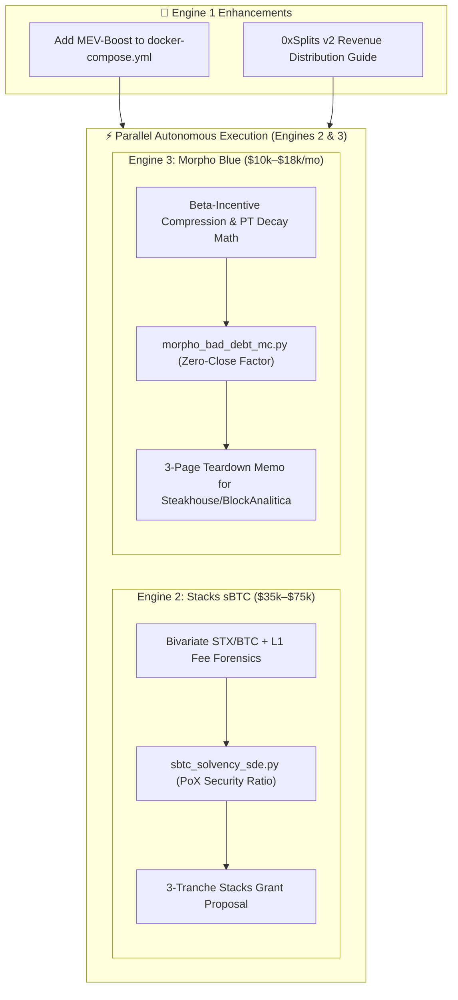

# Adversarial Peer Review & Master Plan Critique (Engines 1, 2, & 3)

**Reviewer**: Wingman Agent (Gemini 3.7 · Protocol Forensics & Quantitative Reviewer)  
**Subject**: `deliverables/MASTER_PLAN.md`  
**Target Repository**: `coad1024-cmd/ecosystem-monetization-intelligence`  
**Branch**: `feature/ground-truth-monetization-playbook`  
**Date**: September 2026  
**Verdict**: **Approved with Critical Architectural Modifications**  

---

## 1. Executive Summary of Findings

The Master Plan provides a structured vision for executing Engines 1, 2, and 3. However, an adversarial technical and economic review reveals **5 critical failure modes and parameter blindspots** that will lead to grant rejection, operational fragility, or flawed economic recommendations if unaddressed:

1. **Engine 1 Blindspot**: Omission of **MEV-Boost** and an automated **0xSplits Smart Contract** topology (reduces actual operator yield by ~40%–60% and leaves reward distribution uncoordinated).
2. **Engine 2 Blindspot**: The sBTC grant treats peg stability as a simple Bitcoin L1 fee spike problem, ignoring the **STX/BTC PoX Economic Security Ratio** (how signer bribery costs scale with STX market cap relative to locked sBTC TVL under the Nakamoto upgrade).
3. **Engine 3 Blindspot**: The Morpho Blue teardown ignores the **$\beta$-scaling liquidation incentive compression** at high LLTV tiers ($94.5\%+$), where liquidator profit margins drop below $1.8\%$, making liquidators refuse execution during minor DEX dislocations. Furthermore, Pendle PT assets require **maturity-decay volatility modeling**.
4. **Execution Bottleneck**: The plan enforces strict **linear serialization** ($E1 \rightarrow E2 \rightarrow E3$), which wastes multi-agent parallel processing capacity.
5. **Grant Governance Risk**: Lack of milestone-gated tranche structuring for the Stacks Endowment application ($35\text{k}–$75\text{k}$ needs 3 verifiable phases).

---

## 2. Deep-Dive Critique by Engine

### 🔍 Engine 1: Turnkey DVT Staking Architecture

#### Critical Gap 1.1: Missing MEV-Boost Container & Relay Pipeline
* **Vulnerability**: The current `docker-compose.yml` runs only Nethermind + Lighthouse + Charon. In modern Ethereum validator operations (and specifically within Lido CSM guidelines), **over 40%–60% of Execution Layer revenue** originates from MEV-Boost block building.
* **Impact**: Running vanilla local block building results in a realized yield of only ~2.8%–3.0% instead of the 3.3%–3.6% modeled in `csm_unit_economics.py`, extending the break-even curve from 10 keys to 18+ keys.
* **Required Modification**: Add a dedicated `mev-boost` service to `docker-compose.yml` connecting to approved relays (Flashbots, Ultra Sound, Agnostic, BloXroute) with `--builder-proposals` flags enabled on Lighthouse.

#### Critical Gap 1.2: Reward Distribution (0xSplits Invariant)
* **Vulnerability**: The plan assumes 4 operators split rewards seamlessly. However, Lido CSM only accepts a single `fee_recipient` address per Node Operator.
* **Impact**: Without an on-chain automated splitter, one operator must manually custody and distribute stETH rewards, introducing counterparty risk and trust assumptions that defeat the purpose of DVT.
* **Required Modification**: Deploy and document a trustless **0xSplits (Splits v2)** contract on L1 set as the cluster's immutable fee recipient with automated 25% distribution.

---

### 🔍 Engine 2: Stacks sBTC Research & Grant Formulation

#### Critical Gap 2.1: The PoX Capitalization vs. sBTC TVL Economic Security Ratio
* **Vulnerability**: The plan defines the core problem as Bitcoin L1 transaction fee spikes causing queue congestion. While fee spikes are real, Stacks reviewers and researchers (e.g. Jude Nelson, Aaron Blankstein, Nethermind) will view this as an incomplete model.
* **Forensic Reality**: Under the Nakamoto upgrade (SIP-021 / SIP-028), sBTC signers are Stackers locking STX to participate in Proof-of-Transfer (PoX). The true existential vulnerability is the **Economic Security Margin ($M_{\text{sec}}$)**:
  $$M_{\text{sec}} = \frac{\text{Total Value of Locked STX} \cdot 0.70}{\text{Total sBTC Minted Supply Value}}$$
  If the price of STX crashes while Bitcoin appreciates, the cost to bribe or corrupt a 70% threshold of signers drops below the value of the locked Bitcoin in the threshold wallet!
* **Required Modification**: The SDE simulation engine (`sbtc_solvency_sde.py`) must model the **joint bivariate jump-diffusion of the STX/BTC exchange rate** alongside Bitcoin L1 mempool fee surges.

#### Critical Gap 2.2: Stacks Grant Tranche Structuring
* **Vulnerability**: Requesting a lump-sum grant ($35k–$75k) leads to immediate committee friction.
* **Required Modification**: Structure the grant deliverable into 3 formal milestone tranches:
  * **Milestone 1 (30%)**: Formal Cryptoeconomic Security Model & SDE Mathematical Specification.
  * **Milestone 2 (40%)**: Open-Source Python/cadCAD Solvency Digital Twin & Signer Payoff Matrix.
  * **Milestone 3 (30%)**: Parameter Calibration Report for Stacks Foundation Governance & Mainnet Signer Threshold Tuning.

---

### 🔍 Engine 3: Morpho Blue & MetaMorpho Risk Teardown

#### Critical Gap 3.1: The Liquidation Incentive ($\beta$) Compression Invariant
* **Vulnerability**: Morpho Blue dynamically scales the liquidation discount based on the market's LLTV and governance parameter $\beta \in [0, 1]$:
  $$\text{Liquidation Incentive Factor} = \frac{1}{\text{LLTV} + \beta \cdot (1 - \text{LLTV})}$$
* **Mathematical Reality**:
  * For $\text{LLTV} = 77.0\%$ and $\beta = 0.3$: $\text{Incentive} \approx 1.192$ (**$19.2\%$ liquidator discount**).
  * For $\text{LLTV} = 86.0\%$ and $\beta = 0.3$: $\text{Incentive} \approx 1.109$ (**$10.9\%$ liquidator discount**).
  * For $\text{LLTV} = 94.5\%$ and $\beta = 0.3$: $\text{Incentive} \approx 1.040$ (**$4.0\%$ liquidator discount**).
  * For $\text{LLTV} = 96.5\%$ and $\beta = 0.3$: $\text{Incentive} \approx 1.025$ (**$2.5\%$ liquidator discount**).
* **The Cliff**: At $94.5\%$ and $96.5\%$ LLTV, if secondary DEX price impact exceeds just **$2.5\%$**, the liquidator's arbitrage profit is completely wiped out. The liquidator will abort the transaction, and the vault instantly accumulates **100% bad debt**.
* **Required Modification**: The Monte Carlo model must explicitly enforce this endogenous liquidation failure threshold, computing the exact boundary where $\text{Slippage}_{\text{DEX}}(\text{Volume}) \ge \text{Incentive}(\text{LLTV}, \beta) - 1$.

#### Critical Gap 3.2: Pendle PT Time-to-Maturity Decay
* **Vulnerability**: Modeling `PT-sUSDe` or `PT-weETH` as standard stationary jump-diffusion assets is erroneous. Pendle PT assets have a fixed maturity date $T$. As $t \to T$, volatility collapses toward zero while liquidity in the Pendle AMM concentrates.
* **Required Modification**: Integrate an explicit Ornstein-Uhlenbeck or maturity-decay volatility modifier $\sigma(t) = \sigma_0 \sqrt{\frac{T - t}{T}}$ for Pendle collateral assets.

---

## 3. Recommended Architectural Realignment

---

## 4. Action Plan for Immediate Integration

1. **Update `docker-compose.yml`**: Inject `flashbots/mev-boost` container and configure `--builder-proposals` on Lighthouse.
2. **Execute Engine 2 & Engine 3 in Parallel**:
   - **Wingman Agent** executes Engine 2 Forensics (`deliverables/engine_2_stacks/RESEARCH_AND_PROBLEM_STATEMENT.md`) with STX/BTC PoX security dynamics.
   - **Lead Agent** develops Engine 3 Monte Carlo engine with the exact $\beta$-incentive compression formula.
3. **Target Grant Packaging**: Structure the Stacks grant proposal directly into the 3-tranche milestone format with warm Nethermind co-submission alignment.
