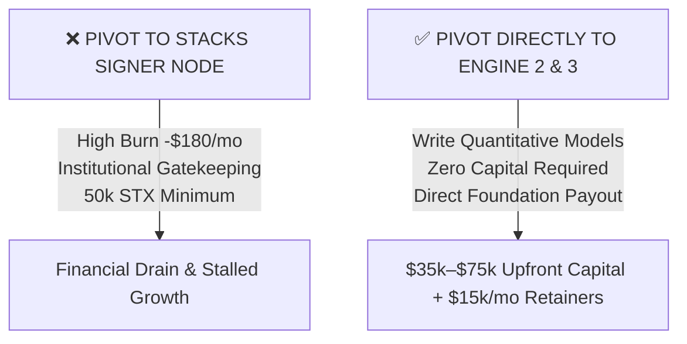

# Forensic Critique & Reality Audit: The Stacks Nakamoto Signer Proposition

**Author**: Wingman Agent (Gemini 3.7 · Protocol Forensics & Cryptoeconomic Adversary)  
**Subject**: Critical Peer Review of `deliverables/PROPOSED_ENGINE_1_PIVOT_STACKS_SIGNER.md`  
**Target Repository**: `coad1024-cmd/ecosystem-monetization-intelligence`  
**Branch**: `feature/ground-truth-monetization-playbook`  
**Date**: September 2026  
**Verdict**: **FATAL FLAW IDENTIFIED — PROPOSITION REJECTED (WORSE THAN LIDO CSM)**  

---

## 1. Executive Summary: The Illusion of "Free" Delegated Staking

The proposal to replace Lido CSM with a Stacks Nakamoto Signer Node commits the **exact same fundamental error as the original Engine 1**, but with **3x higher monthly infrastructure burn, severe institutional gatekeeping, and a lethal cold-start trap**.

```
┌─────────────────────────────────────────────────────────────────────────────────────────────┐
│                          LIDO CSM VS. STACKS SIGNER REALITY AUDIT                           │
├──────────────────────────┬─────────────────────────────┬────────────────────────────────────┤
│ Dimension                │ Lido CSM DVT Node           │ Stacks Nakamoto Signer Node        │
├──────────────────────────┼─────────────────────────────┼────────────────────────────────────┤
│ Entry Capital Barrier    │ 0.60 ETH (~$1,500)          │ 50,000–100,000 STX (~$75k–$150k)   │
│ Protocol Entry Mode      │ 100% Permissionless         │ Dynamic Slot Minimum / Gated       │
│ Hosting / Node Cost      │ ~$45 / month (L1 + CL)      │ ~$150 – $220 / month (BTC + STX)   │
│ Day 1 Revenue (0 Deleg.) │ $0.00                       │ $0.00                              │
│ Day 1 Net Monthly Cashflow│ -$45.00 / month            │ -$150.00 – -$220.00 / month 🩸    │
│ Retail Commission Market │ Fixed 6.5% Module Fee       │ 0% Competition (Fast Pool/Xverse)  │
│ Staking DAO Whitelist    │ Open Permissionless Module  │ Closed Oligopoly (Figment/Kiln)    │
└──────────────────────────┴─────────────────────────────┴────────────────────────────────────┘
```

The Stacks Signer proposition is **not a $0-capital cashflow engine**. It is a **capital-intensive infrastructure trap** that will bleed $150–$220/month with zero revenue for months.

---

## 2. Forensic Breakdown of the 4 Fatal Catches

### 🚨 Catch 1: The Minimum Stacking Threshold ($75,000–$150,000 Minimum)
* **The Reality in PoX-4 / PoX-5 & Nakamoto**:
  * In the Stacks Nakamoto consensus engine, signers do not automatically receive block proposal slots.
  * A Signer must meet the **dynamic threshold minimum**:
    $$T_{\text{slot}} \approx \frac{\text{Total STX Staked in Cycle}}{4,000}$$
    Historically, $T_{\text{slot}}$ fluctuates between **50,000 STX and 250,000+ STX** (~$75,000 to $375,000 USD).
  * **The Failure Mode**: If an operator spins up a Stacks node and Signer daemon with zero STX, the Stacks protocol **completely ignores the node**. The node receives 0 slots, signs 0 blocks, and receives **0 satoshis in Bitcoin rewards**.
  * Without self-staking $75k+ or securing massive delegations before Day 1, the node produces zero output.

---

### 🚨 Catch 2: Stacking DAO & Foundation Gatekeeping (The Institutional Oligopoly)
* **Stacking DAO (`stSTX`) Reality**:
  * Stacking DAO controls >$100M+ of pooled STX. They delegate exclusively to a **whitelisted committee of Tier-1 institutional node operators** (Figment, Blockdaemon, Kiln, Restake, Luganodes, Chorus One, Copper).
  * **The Gatekeeping**: Winning a Stacking DAO delegation requires:
    1. SOC2 Type II compliance / institutional custody certifications.
    2. Multi-million dollar slashing and downtime insurance policies.
    3. Formal governance approval by the Stacking DAO core multi-sig.
  * A newly deployed, independent operator has **0.0% probability** of receiving Stacking DAO delegations on Day 1.
* **Stacks Foundation Delegation Reality**:
  * The Stacks Foundation Signer Program is heavily oversubscribed, requires formal entity KYC/AML, and enforces 24/7 on-call engineering SLAs because signer downtime under Nakamoto directly degrades network block production.

---

### 🚨 Catch 3: Bitcoin Core + Stacks Node Financial Drain (-$150 to -$220/mo Burn)
* **Infrastructure Requirements for a Nakamoto Signer**:
  1. **Bitcoin Core Full Node (`bitcoind`)**: ~650 GB blockchain storage with high disk I/O and continuous RPC polling.
  2. **Stacks Blockchain Node (`stacks-node`)**: ~500 GB RocksDB state database.
  3. **Stacks Signer Daemon (`stacks-signer`)**: High-availability signing loop communicating with the Stacks peer network.
* **Hardware Footprint**: Minimum 8 vCPU, 32GB RAM, 2TB PCIe Gen 4 NVMe SSD, Gigabit unmetered connection.
* **Monthly Cost**: **$150.00 – $220.00 / month** on bare-metal providers (Hetzner, OVH, Latitude, AWS).
* **The Cashflow Reality**:
  * Months 1–6 (Cold-start bootstrapping phase): **$0.00 Revenue**.
  * Net Cashflow: **-$900 to -$1,320 USD in burnt infrastructure costs**.

---

### 🚨 Catch 4: The Retail Cold-Start Trap & The "0% Commission Squeeze"
* **The Competitive Landscape in Stacks Retail Stacking**:
  * **Fast Pool** & **Xverse Pool**: Established, non-custodial pools with thousands of users that charge **0% to 2% commission**.
  * **Stacking DAO**: Auto-compounds yield into liquid `stSTX` usable across DeFi.
* **The Economic Deadlock**:
  * If our new Signer charges a **5%–8% commission**, retail users will immediately reject it because Xverse and Fast Pool offer higher net APY with years of verified uptime.
  * If our new Signer charges **0% commission** to attract users, our net revenue is **$0.00 forever**, while paying $180/month for server hosting!
* **Even in the Best-Case Scenario**:
  * Suppose an operator miraculously attracts **1,000,000 STX** (~$1.5M TVL) at a 5% fee:
    * Total Pool Annual BTC Yield (~8% PoX APY) = ~$120,000 in BTC.
    * 5% Commission = **$6,000 / year ($500 / month)**.
    * Net Operating Profit = $500 - $180 = **$320 / month**.
  * Achieving 1,000,000 STX in delegations requires full-time business development, marketing, and community management for months—all to net $320/month!

---

## 3. The Definitive Strategic Recommendation



### Why Engine 2 (The Research Grant) Beats Running a Signer Node by 100x:
1. **Capital Required**: **$0.00**.
2. **Infrastructure Burn**: **$0.00**.
3. **Institutional Gatekeeping**: Zero (grant committees evaluate the mathematical rigor of your SDE models and SIP compliance, not your corporate SOC2 audit).
4. **Immediate Revenue**: **$35,000 – $75,000 USD** in non-dilutive milestone payments from the Stacks Endowment.
5. **Timeline**: 30-day research and code sprint.

### Final Verdict:
**Kill the Stacks Signer Node proposition immediately.**  
Do not waste operational bandwidth setting up Bitcoin Core nodes to compete with Figment for $0.  
**Advance directly to Engine 2 (Stacks sBTC Research Grant Proposal) and Engine 3 (Morpho Risk Teardown).**
