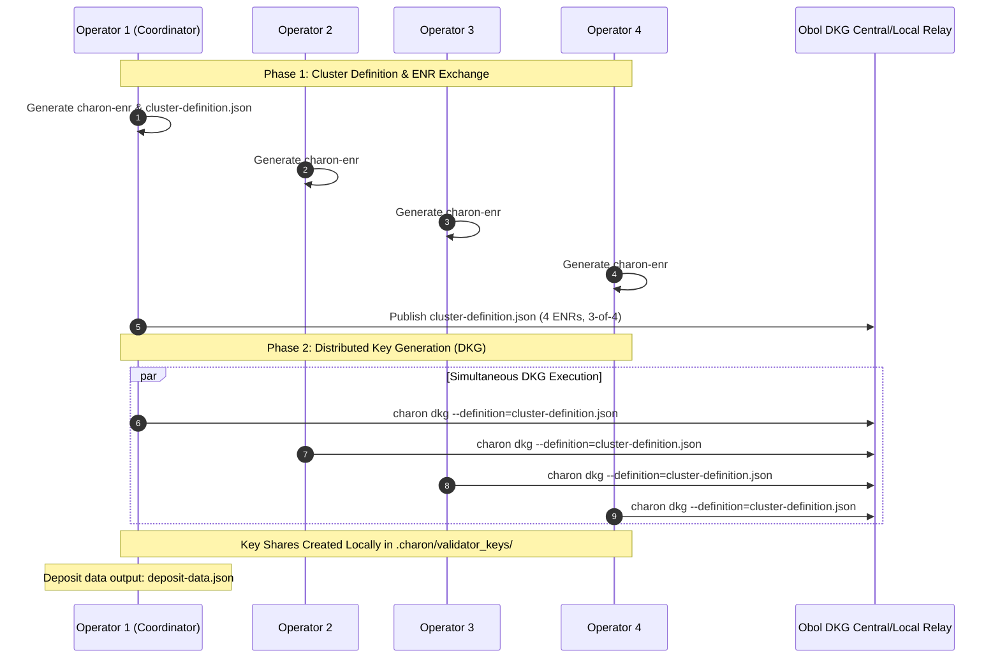

# Engine 1 Operational Specification & Deployment Runbook

**Topology**: 4-Node Obol Charon DVT Cluster (3-of-4 Byzantine Fault Tolerant)  
**Protocol Target**: Lido Community Staking Module (CSM V3)  
**Consensus Target**: Ethereum Mainnet / Holesky Testnet  
**Author**: Lead Agent (Antigravity Architecture)  
**Status**: Ready for Automated Infrastructure Provisioning  

---

## 1. System Invariants & Slashing Prevention Architecture

### 1.1 The 3-of-4 Threshold Invariant
In an Obol Charon cluster of $N=4$ nodes, threshold $T=3$:
- Any single node can crash, be compromised, or desynchronize without halting consensus or missing duties.
- **Slashing Prevention**: A single malfunctioning or rogue validator client cannot sign an equivocation (double-proposal or surround vote). Charon nodes exchange partial signature shares over QBFT consensus; a valid BLS aggregate signature cannot be formed without 3 distinct nodes confirming duty hashes.
- **EIP-3076 Slashing Protection**: Each local consensus/validator client maintains its local slashing protection database, with Charon acting as the Byzantine-fault-tolerant proxy.

```
       +-------------------------------------------------------------+
       |                  OBOL 4-NODE P2P CLUSTER                    |
       |                                                             |
       |  [Node 1: Local] <======= LibP2P ======> [Node 2: Remote]   |
       |         ^  \                                 /  ^           |
       |         |   \                               /   |           |
       |      LibP2P  \                             /  LibP2P        |
       |         |     \                           /     |           |
       |         v      \                         /      v           |
       |  [Node 3: Remote] <======= LibP2P ======> [Node 4: Remote]  |
       +-------------------------------------------------------------+
```

---

## 2. Ports, Networking & Firewall Specifications

Each operator runs an isolated stack. Only the Charon P2P port is exposed to the public internet (or restricted WireGuard mesh).

| Service | Container Port | Host Port | Protocol | Scope | Purpose |
|:---|:---|:---|:---|:---|:---|
| **Charon P2P** | `3610` | `3610` | TCP/UDP | Public / Mesh | BFT Consensus & Signature Exchange |
| **Charon Monitoring** | `3620` | `127.0.0.1:3620` | TCP | Localhost | Prometheus Metrics Scrape |
| **Validator Client API** | `3600` | `127.0.0.1:3600` | TCP | Localhost | VC to Charon Middleware Proxy |
| **Consensus Client P2P**| `9000` | `9000` | TCP/UDP | Public | Beacon Chain Sync (Lighthouse/Teku) |
| **Execution Client P2P**| `30303`| `30303` | TCP/UDP | Public | Ethereum EL Sync (Nethermind/Besu) |
| **Engine API (EL<->CL)**| `8551` | `127.0.0.1:8551` | TCP | Localhost | Authenticated JWT Engine API |

---

## 3. Distributed Key Generation (DKG) Ceremony Sequence

The DKG ceremony is executed without any party possessing the master private key at any time:



---

## 4. Lido CSM Registration & Smart Contract Call

1. **Verify Deposit Data**: Ensure the generated root withdrawal credentials match Lido's Withdrawal Vault:
   * **Mainnet Lido Withdrawal Credentials**: `0x010000000000000000000000b9d7934878b5fb9610b3fe8a5e441e8fad7e293f`
   * **Holesky Lido Withdrawal Credentials**: `0x01000000000000000000000028fab2059c713a7f9d8c86db49f9ffb9e322d924`
2. **Submit Keys via Lido CSM Contract**:
   * Contract: `CSModule.sol` via `createNodeOperator` or `addSigningKeys`.
   * Post wstETH or stETH bond required by `BondCurvesLib.sol` (2.40 ETH for key 1, 1.30 ETH for subsequent keys).
   * Bond is held in `Accounting.sol` and earns rebases continuously.
