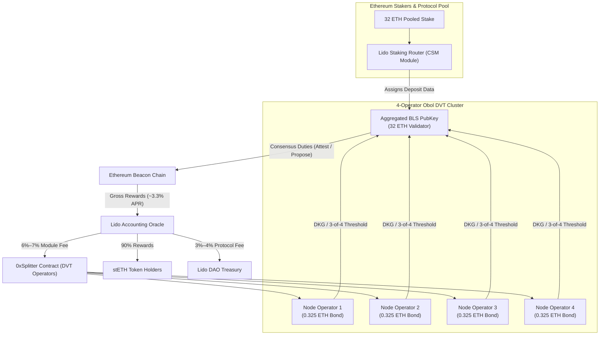
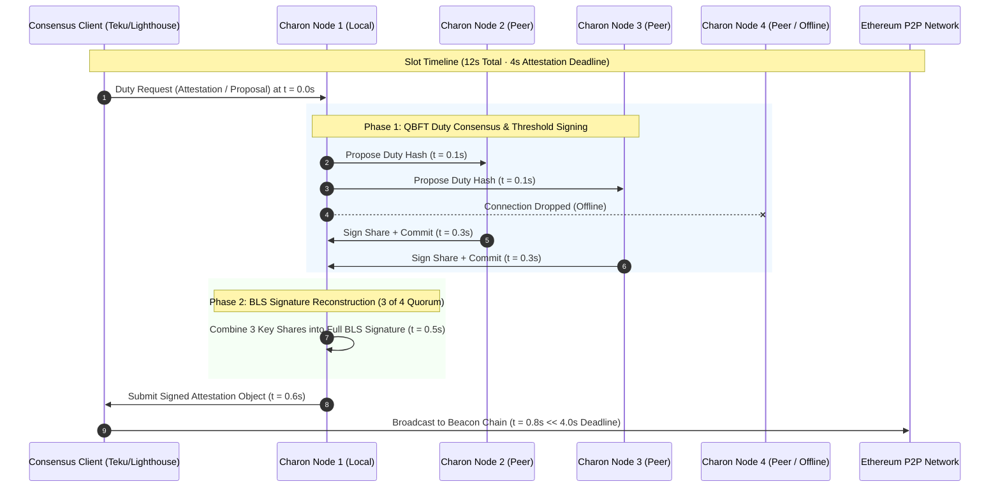

# Engine 1 Forensics & Research: Lido CSM + Obol DVT Staking Architecture

**Author**: Wingman Agent (Gemini 3.7 · Protocol Forensics & Quantitative Research)  
**Target Repository**: `coad1024-cmd/ecosystem-monetization-intelligence`  
**Branch**: `feature/ground-truth-monetization-playbook`  
**Date**: September 2026  
**Status**: Ready for Synthesis & Deployment  

---

## 1. Executive Summary & Problem Formulation

Solo staking on Ethereum requires **32 ETH** (~$80,000+ USD) in liquid capital and concentrates 100% of operational risk on single-machine uptime and single-client failure modes. Conversely, delegating to centralized liquid staking providers forfeits operational control and extracts significant commission fees.

**Engine 1** implements a **4-operator Distributed Validator Technology (DVT) cluster** integrated into **Lido's Community Staking Module (CSM)**. This architecture:
1. **Lowers Capital Barriers**: Reduces per-operator bond requirements from 32 ETH down to **0.325 – 0.60 ETH** per validator key (3.1x – 4.0x capital efficiency multiplier).
2. **Eliminates Slashing & Downtime Cliffs**: Employs a **3-of-4 Byzantine Fault Tolerant (BFT)** threshold signature scheme via **Obol Charon**, allowing any single node to experience catastrophic hardware, power, or network failure with **zero missed attestations and zero slashing penalties**.
3. **Maximizes Net Cashflow**: Captures protocol-level Node Operator module fees (~6.0%–7.0% of gross 32 ETH staking yield) while the operator's bonded capital rebases at full stETH market yields (~3.0%–3.3% APR), achieving an effective **7.8%–8.3% APR in ETH** on bonded capital.

---

## 2. Lido CSM Live Architecture & Parameter Specifications

### 2.1 Bond Requirements & Stepped Curve
In Lido CSM, the Node Operator bond is posted in **stETH/wstETH**, acting as first-loss capital protection against underperformance or slashing while continuously earning stETH rebase yield.

* **Permissionless Entry Bond Curve**:
  * **Validator 1 (Initial Entry)**: **2.40 ETH** (or equivalent wstETH).
  * **Validator 2 and Subsequent (Keys 2..N)**: **1.30 ETH** per validator key.
* **4-Operator DVT Cluster Amortization**:
  * **Key 1**: $2.40 \text{ ETH} / 4 = \mathbf{0.60\text{ ETH}}$ per operator.
  * **Keys 2..N**: $1.30 \text{ ETH} / 4 = \mathbf{0.325\text{ ETH}}$ per operator.

### 2.2 Reward-Sharing Split & Module Fees
The standard Lido protocol fee structure allocates **10% of gross rewards** as protocol fees, with **90%** flowing directly to stETH holders. 

Within the Community Staking Module:
* **Node Operator Fee Share**: **6.0% – 7.0%** of total staking rewards generated by the full 32 ETH pool.
* **Lido DAO Treasury Share**: **3.0% – 4.0%**.
* **Collateral Rebase**: The operator's 1.3–2.4 ETH bond is held in stETH and earns 100% of standard stETH rebase rewards (~3.0%–3.3% net APR).

### 2.3 Slashing, Ejection, and Penalty Mechanics
Lido CSM decouples network health monitoring from execution-layer penalties via its **Performance Oracle**:

1. **Frame Evaluation (24-Hour Windows)**:
   * The Performance Oracle computes the attestation effectiveness ratio over 24-hour rolling frames.
   * If a validator drops below the threshold ($\approx 95\%$ effectiveness), **Node Operator rewards are forfeited for that frame**.
2. **Underperformance "Strikes" & Forced Ejection**:
   * Recurring underperformance registers on-chain "strikes".
   * Upon exceeding the maximum strike threshold, the module initiates an automated **EIP-7002 forced exit request** to trigger validator ejection.
   * An on-chain `badPerformancePenalty` is deducted from the deposited bond.
3. **Slashing & Deficit Handling**:
   * Missing attestations is **not a slashable event** (only produces negligible offline balance leaks).
   * In the event of an EL double-sign or surround vote slashing, the withdrawal shortfall ($\Delta = 32.0\text{ ETH} - \text{Balance}_{\text{exit}}$) is burned directly from the operator's bond via Lido's `Burner` contract.
   * Because a 3-of-4 DVT cluster requires agreement from 3 independent signers before broadcasting any message, **the probability of a software bug or operator error causing a double-sign is near zero**.

---

## 3. Obol Charon vs. SSV Network: Protocol Comparison

| Dimension | Obol Network (Charon) | SSV Network | Engine 1 Selection Rationale |
|:---|:---|:---|:---|
| **Architectural Model** | Decentralized Middleware Client | Protocol-Integrated DVT-as-a-Service | **Obol**: Independent cluster isolation with zero third-party smart contract dependencies. |
| **Consensus Protocol** | QBFT (Quorum Byzantine Fault Tolerance) | Alea-BFT / QBFT | **Obol**: Deterministic round-based consensus optimized for 4–7 operator meshes. |
| **Token Friction & Tax** | **Zero Token Tax** (Native ETH/BLS) | **SSV Token Required** (Operator fees + Network fee) | **Obol**: No token volatility risk, no liquidation margin management, no runway depletion. |
| **Cluster Topology** | Private/Sovereign Peer-to-Peer Mesh (LibP2P) | Public Registry Marketplace | **Obol**: Direct control over operator pairings, latency bounds, and infrastructure quality. |
| **Client Compatibility** | Standard Engine API (Lighthouse, Teku, Nimbus, Lodestar) | Custom SSV Node Binary | **Obol**: Plugs directly into standard EL/CL client setups without proprietary modifications. |
| **Net Operator Yield** | **Maximum** (100% of Lido NO fees retained) | **Reduced** (Net of SSV operator fees + network burn) | **Obol**: Eliminates intermediaries for predictable validator cashflows. |

---

## 4. Hardware, Latency & Failure Modes

### 4.1 Latency Budgets & The 4-Second Slot Boundary
Ethereum consensus operates on **12-second slots**, divided into three 4-second phases:
* **0.0s – 4.0s**: Block proposal and attestation production. Attestations **must** be received by peers before $t = 4.0\text{s}$ to be included in the head block.
* **4.0s – 8.0s**: Attestation aggregation.
* **8.0s – 12.0s**: Aggregate broadcast.

To ensure attestations are broadcast within the first $1.0\text{s}–1.5\text{s}$:
* **Maximum Allowable Inter-Operator RTT**: $\le 150\text{ms}$ recommended ($\le 250\text{ms}$ hard ceiling).
* **Geographic Distribution**: Operators across US East, US West, and Western Europe achieve typical ping latencies of **70ms – 110ms**, which easily accommodates the 3-round QBFT consensus handshake within **~400ms**.

### 4.2 Hardware & System Requirements per Operator
* **CPU**: 4 Cores (Modern x86_64 or ARM64, e.g., AMD EPYC, Intel Xeon, Apple Silicon, AWS Graviton).
* **RAM**: 16 GB DDR4/DDR5 ECC RAM minimum (32 GB recommended if hosting local EL/CL).
* **Storage**: 2 TB NVMe SSD (PCIe Gen 3/4, IOPS $> 10,000$) to run Nethermind/Besu + Lighthouse/Teku.
* **Bandwidth**: 1 Gbps symmetric fiber connection with static IP or dynamic DNS.
* **Time Synchronization**: Mandatory active `chrony` or `systemd-timesyncd` with NTP clock offset $< 50\text{ms}$.

---

## 5. Unit Economics, Yield & Break-Even Modeling

### 5.1 Comprehensive Yield Model per Validator Key
Let:
* $S = 32.0\text{ ETH}$ (Pooled validator stake).
* $Y_{\text{gross}} = 3.30\%$ (Gross Ethereum Beacon Chain staking yield).
* $f_{\text{NO}} = 6.50\%$ (Lido CSM Node Operator fee share).
* $B = 1.30\text{ ETH}$ (Bond per subsequent validator key).
* $Y_{\text{stETH}} = 3.00\%$ (Net stETH rebase yield on bonded capital).
* $N_{\text{ops}} = 4$ (Operators in DVT cluster).

$$\text{Gross Annual Yield per Key} = S \cdot Y_{\text{gross}} = 32.0 \cdot 0.0330 = 1.056\text{ ETH/year}$$
$$\text{Annual Operator Fee} = 1.056 \cdot f_{\text{NO}} = 1.056 \cdot 0.0650 = 0.06864\text{ ETH/year}$$
$$\text{Annual Bond Rebase Yield} = B \cdot Y_{\text{stETH}} = 1.30 \cdot 0.0300 = 0.03900\text{ ETH/year}$$
$$\text{Total Annual Value per Key} = 0.06864 + 0.03900 = \mathbf{0.10764\text{ ETH/year}}$$

Per Individual Operator in a 4-Node Cluster:
* **Bond Contributed**: $1.30 / 4 = \mathbf{0.325\text{ ETH}}$
* **Annual ETH Reward**: $0.10764 / 4 = \mathbf{0.02691\text{ ETH/year}}$
* **Effective Capital Return (APR)**:
  $$\text{APR}_{\text{effective}} = \frac{0.02691\text{ ETH}}{0.325\text{ ETH}} = \mathbf{8.28\%\text{ APR in ETH}}$$

### 5.2 Multi-Key Scaling & Cost Break-Even Matrix
Assuming:
* ETH Price = **$2,500 USD**
* Hardware / VPS Hosting Cost per Operator = **$45.00 USD / month** ($540 USD / year)
* One-Time On-Chain Setup Gas (L1 DKG verification + CSM registration) = **0.025 ETH** (~$62.50 USD)

| Cluster Validator Keys | Total Bond / Operator (ETH) | Gross Return / Operator (ETH/yr) | Gross Return / Operator (USD/yr) | Server Cost (USD/yr) | Net Cashflow / Operator (USD/yr) | Net APR on Bond |
|:---:|:---:|:---:|:---:|:---:|:---:|:---:|
| **1 Key** | 0.600 ETH ($1,500) | 0.0337 ETH | $84.25 | $540.00 | **-$455.75** | Negative (Home Staker / Lab only) |
| **5 Keys** | 1.900 ETH ($4,750) | 0.1413 ETH | $353.25 | $540.00 | **-$186.75** | Partial Offset |
| **10 Keys** | 3.525 ETH ($8,812) | 0.2759 ETH | $689.75 | $540.00 | **+$149.75** | **Break-Even Passed** (6.7% Net) |
| **25 Keys** | 8.400 ETH ($21,000) | 0.6795 ETH | $1,698.75 | $540.00 | **+$1,158.75** | **7.52% Net APR** |
| **50 Keys** | 16.525 ETH ($41,312)| 1.3523 ETH | $3,380.75 | $540.00 | **+$2,840.75** | **7.90% Net APR** |
| **100 Keys**| 32.775 ETH ($81,937)| 2.6978 ETH | $6,744.50 | $540.00 | **+$6,204.50** | **8.09% Net APR** |

---

## 6. Implementation & Operational Next Steps

1. **Local Testbed DKG Ceremony**: Execute a distributed key generation ceremony using `charon create dkg` across 4 local containerized environments.
2. **Holesky Testnet CSM Onboarding**: Register the generated threshold deposit data with the Lido CSM Holesky deployment contract.
3. **Automated Prometheus / Grafana Dashboard Deployment**: Wire `charon_duty_duration_seconds`, `charon_consensus_rounds_total`, and `lighthouse_attestations_total` into real-time monitoring alerts.
