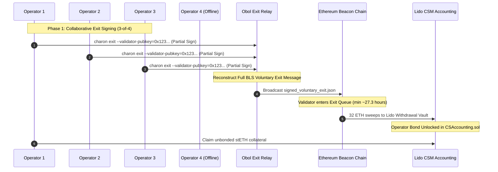

# Engine 1 Validator Exit & Unbonding Runbook

**Protocol Target**: Lido Community Staking Module (CSM V3)  
**Cluster Architecture**: 4-Node Obol Charon DVT (3-of-4 Byzantine Fault Tolerant)  
**Standards**: Ethereum Voluntary Exit Specification, EIP-7002 (Execution-Layer Triggered Exits), Lido Exit Bus  

---

## 1. Overview & Exit Dynamics in DVT

In standard solo staking, a single validator client signs a voluntary exit message with its private key. In a **4-operator Obol DVT cluster**:
- The validator private key is split into 4 threshold shares.
- **A valid voluntary exit message requires 3 out of 4 operators to participate in threshold exit signing.**
- This prevents a single rogue or compromised operator from prematurely exiting the cluster's validators.



---

## 2. Procedure A: Voluntary Operator Exit (Planned Unbonding)

When operators collectively decide to exit validator keys to retrieve their bonded stETH/wstETH capital:

### Step 1: Verify Validator Index & Current Epoch
Ensure the target validator has been active on the Beacon Chain for at least 2,048 epochs (approx. 9 days) since activation.
```bash
# Query Beacon Node for validator status
curl -s http://localhost:5052/eth/v1/beacon/states/head/validators/0x<VALIDATOR_PUBKEY> | jq .data.status
```

### Step 2: Execute Threshold Exit Command (Run by at least 3 operators)
Each operator executes the `charon exit` command targeting the specific validator public key:

```bash
docker run --rm -it \
  -v "$(pwd)/.charon:/opt/charon/.charon" \
  --net=host \
  obolnetwork/charon:v1.3.0 exit \
  --beacon-node-endpoints=http://127.0.0.1:5052 \
  --cluster-dir=/opt/charon/.charon \
  --validator-pubkey=0x<VALIDATOR_PUBKEY> \
  --publish
```

### Step 3: Exit Broadcast Confirmation
Once the 3rd operator signs, Charon reconstructs the full BLS signature and broadcasts `signed_voluntary_exit.json` directly to the Beacon Node.
```text
[INFO] 3/4 Partial Exit Signatures collected.
[INFO] Reconstructing aggregate BLS VoluntaryExit signature...
[SUCCESS] VoluntaryExit message successfully submitted to Beacon Node for validator 0x123...
[INFO] Validator status updated to 'active_exiting'.
```

---

## 3. Procedure B: Lido CSM Exit Requests (Validator Exit Bus)

Lido DAO monitors protocol-wide liquidity and stETH withdrawal queue demand. When Lido requests a validator to exit:

1. **Exit Bus Notification**: The Lido Validator Exit Bus oracle emits an on-chain event specifying the `nodeOperatorId` and `validatorIndex`.
2. **Automated Monitoring**: Operators receive alerts via Lido CSM alerts or Prometheus.
3. **Grace Period**: Operators have **24–48 hours** to complete the 3-of-4 exit signing before the Performance Oracle registers a strike.
4. **Execution**: Follow **Procedure A** above for the requested key.

---

## 4. Procedure C: EIP-7002 Execution Layer Triggered Exits

Under Ethereum's **EIP-7002**, smart contracts deployed at the withdrawal credentials address can trigger an exit directly from the Execution Layer without requiring consensus-layer signatures from node operators:

* **Trigger**: If an operator becomes unresponsive or accumulates excessive strikes, Lido's `CSModule.sol` calls the EIP-7002 precompile (`0x00000000219ab540356cbb839cbe05303d7705fa`).
* **Result**: The Beacon Chain forces the validator into the exit queue immediately.
* **Bond Penalty**: Lido's `CSAccounting.sol` automatically deducts the `badPerformancePenalty` from the deposited bond and returns the remaining collateral.

---

## 5. Phase 4: Reclaiming the Deposited Bond in Lido CSM

Once the validator completes the Beacon Chain exit queue and sweeps the 32 ETH principal back to the Lido Withdrawal Vault:

1. **Verify Exit in CSM Accounting**:
   ```bash
   # Check if key is marked as EXITED in Lido CSM
   python3 deliverables/engine_1_dvt/scripts/claim_csm_rewards.py --network=mainnet --operator-id=1 --dry-run
   ```
2. **Submit Unbond Transaction**:
   * Navigate to `https://csm.lido.fi` (or call `CSModule.claimUnbonded(nodeOperatorId)` via Gnosis Safe).
   * The deposited **2.40 ETH** (Key 1) or **1.30 ETH** (Keys 2..N) bond is unlocked and refunded as stETH shares to the configured operator reward/withdrawal address.
3. **Distribute Unbonded Capital via 0xSplits**:
   * Call `0xSplits.distributeERC20(splitAddress, stETH)` to deliver each operator's 25% share of the refunded bond.
