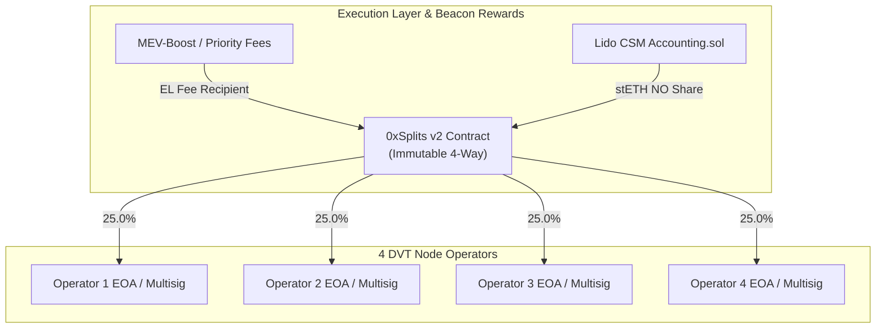

# Engine 1 Trustless Revenue Distribution: 0xSplits Architecture

**Protocol Target**: 0xSplits (Splits v2) on Ethereum Mainnet & Holesky Testnet  
**Author**: Lead Agent (Antigravity Architecture)  
**Status**: Ready for Deployment & Contract Integration  

---

## 1. Problem Solved: Eliminating Operator Custody Risk

In Lido CSM, each registered Node Operator (`nodeOperatorId`) specifies a single address:
- `rewardAddress`: Receives continuous Node Operator fee shares (in stETH/wstETH) distributed by Lido's `Accounting.sol` via `pullAndSplitFeeRewards`.
- `fee_recipient`: Receives Priority Fees and MEV block building rewards at the Execution Layer (EL).

In a **4-operator DVT cluster**, pointing these addresses to an individual operator's EOA introduces:
1. **Counterparty & Custody Risk**: Operator 1 must manually distribute rewards to Operators 2, 3, and 4.
2. **Tax & Legal Friction**: Operator 1 appears to receive 100% of the gross income.
3. **Withholding Attack**: If Operator 1 halts distributions or gets slashed/locked out, remaining operators suffer total loss of cashflow.

---

## 2. Architecture: Splits v2 Integration

We deploy a **Pull-Split** via the canonical **0xSplits SplitFactory**:
- **Split Type**: Immutable 4-Way Pro-Rata Split (25% each).
- **Recipients**: Operator 1 (`0xOp1...`), Operator 2 (`0xOp2...`), Operator 3 (`0xOp3...`), Operator 4 (`0xOp4...`).
- **Distribution Incentive**: Anyone can call `distributeETH` or `distributeERC20` (permissionless, bot-incentivized).



---

## 3. Deployment Script & Verification

### 3.1 Factory Addresses
* **Ethereum Mainnet SplitFactory (v2)**: `0x2ed6c4e5a987829875150f1604a112ec4d8f7bfd`
* **Holesky Testnet SplitFactory (v2)**: `0x2ed6c4e5a987829875150f1604a112ec4d8f7bfd`

### 3.2 Deployment Specification (`deploy_split.py` / Cast)
Using Foundry's `cast` or Python Web3:

```bash
# Create immutable 4-way split: 250,000 basis points (25%) per operator
cast send 0x2ed6c4e5a987829875150f1604a112ec4d8f7bfd \
  "createSplit((address[],uint32[],uint32,address),address,address)" \
  "([0xOp1,0xOp2,0xOp3,0xOp4],[250000,250000,250000,250000],0,0x0000000000000000000000000000000000000000)" \
  0x0000000000000000000000000000000000000000 \
  0xOp1 \
  --rpc-url $RPC_URL \
  --private-key $PRIVATE_KEY
```

---

## 4. Configuration Binding to Stack

Once the split contract is deployed at address `0xSplitContractAddress`:
1. **Lido CSM**: Call `setCustomRewardsClaimer(nodeOperatorId, 0xSplitContractAddress)`.
2. **Validator Stack**: Set `FEE_RECIPIENT_ADDRESS=0xSplitContractAddress` in `.env`.
